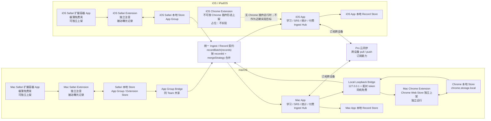

# 扩展与 App 解耦 + Ingest 契约设计 / Extension-App Decoupling & Ingest Contract

Date: 2026-06-18

目标：**插件可以独立运行和上架，App 也可以不和 Safari 插件绑定。** App 只扮演学习和数据摄取 hub：Safari 扩展、Chrome 扩展、未来云同步只要按同一份 ingest 契约提交 records，App 就能合并并展示/学习；App 不把数据来源写进业务分支。

本文是目标架构和实施路线，不是实现。它修正并取代 `SYNC_AND_CLIENTS_DESIGN.md` 里「Safari 容器 app 顺便承载学习 app」以及「Chrome 只能通过云进 Mac app」的旧假设。具体 wire contract 见 [INGEST_PROTOCOL.md](INGEST_PROTOCOL.md)。

---

## 1. 目标客户端矩阵

| 客户端 | 是否独立运行 | 是否独立上架 | 本地数据 | 与学习 App 连接 |
|---|---:|---:|---|---|
| Mac Safari 扩展 | 是 | 是，但必须通过极薄 Safari 扩展容器 App | App Group / extension local store | 同机 App Group ingest |
| Mac Chrome 扩展 | 是 | 是，Chrome Web Store | `chrome.storage.local` | 同机 loopback ingest |
| Mac App | 是 | 是，Mac App Store / 后续直分发可选 | App 自己的 record store | Ingest hub + 学习/SRS/统计 |
| iOS Safari 扩展 | 是 | 是，但必须通过极薄 iOS Safari 扩展容器 App | App Group / extension local store | 同机 App Group ingest 到 iOS App |
| iOS App | 是 | 是，App Store | App 自己的 record store | Ingest hub + 学习/SRS/统计 |
| iOS Chrome 扩展 | 否 | 否 | 无 | iOS Chrome 不提供 Chrome WebExtension 上架/运行路径，暂不作为真实目标 |

**关键结论：**

- Safari 扩展不能裸上架；「独立上架」的实际形态是一个免费薄容器 App + Safari appex。
- Chrome 扩展必须能不装 Mac App 也正常注音和记录本地曝光。
- Mac/iOS App 不能假设 Safari 扩展存在；它只认 ingest records。
- iOS Chrome 扩展目前只保留为产品矩阵占位，不进入 MVP/近期实现。

---

## 2. 目标架构图



---

## 3. 为什么要改

现状的耦合点有三个：

1. **传输只有 App Group 和云两档。** App Group 是 Apple 沙盒机制，Chrome 扩展碰不到它；旧设计导致 Chrome -> Mac App 只能靠云同步。
2. **云同步是 Pro 付费。** 同一台 Mac 上「Chrome 扩展 + Mac App 学习」被迫走 Pro，会把同机本地场景错误地关进订阅墙。
3. **Safari 扩展和学习 App 打包焊在一起。** 旧设计让 Safari 容器 App 同时承担学习 App，扩展缺少独立产品身份，App 也很难不带 Safari 插件发布。

根因是按来源组织数据流，而不是按契约组织数据流。新路线把契约提到中心：**插件负责捕获和本地可用，App 负责学习和 ingest，transport 只负责搬运。**

---

## 4. Ingest 契约边界

`packages/core-schema/schema/record-store-v1.schema.json` 现在是 **snapshot / migration prototype**，不是可直接上线的 ingest wire format。它提供了正确的 record 形状和 deterministic `recordId` 起点，但仍需要正式 batch 协议、merge API、delta 语义和 runtime storage 迁移。

因此本路线把它定义为：

- 已有基础：record shape、`recordId = type + encode(logicalId)`、`mergeStrategy` 枚举、AppState <-> record snapshot 验证。
- 待补协议：`recordBatch` 信封、push/pull cursor、ack、source identity、transport error 语义。
- 待补实现：`mergeRecord(existing, incoming)`、`ingestBatch(store, batch)`、Swift/JS golden vectors 对齐。

### 4.1 主键

Ingest 必须按 `recordId` 合并，而不是单独按 `logicalId` 合并。原因：同一个词 id 可以同时存在于多个 record type：

```text
lexicalItem:確認%3Aかくにん
userLexicalState:確認%3Aかくにん
exposureIndex:確認%3Aかくにん
```

伪代码：

```text
ingestBatch(batch):
  validate batch envelope
  for record in batch.records:
    assert record.recordId == createRecordId(record.type, record.logicalId)
    existing = store.get(record.recordId)
    next = mergeRecord(existing, record, record.mergeStrategy)
    store.put(record.recordId, next)
  bump local storageRevision
  return ack(batch.batchId, appliedRecordIds, newCursor)
```

### 4.2 双向

App 不只是 sink，也是 source。学习结果、Known/Forgot/Ignore、淡出等级变化、设置变化，需要通过同一套 batch/cursor 机制让扩展拉取或接收。

初版可以先做：

- extension -> app: push exposure records。
- app -> extension: pull changed user state/settings。

不要先实现单向接口后再返工。

### 4.3 隐私边界

来源在生成 records 前必须套好 URL 策略。App ingest 不做二次清洗，只校验 record schema 和来源权限。`saveUrls=domain_only` 时，扩展不得把 full URL/page title 写进 batch。

---

## 5. Transport 设计

| Transport | 谁 ↔ 谁 | 场景 | 收费 | 近期实现 |
|---|---|---|:--:|---:|
| App Group | Safari 扩展容器 App ↔ 学习 App | 同设备 Apple 平台 | 免费 | 是 |
| Loopback | Mac Chrome 扩展 ↔ Mac App | 同设备 macOS | 免费 | 是 |
| Cloud pull/push | Mac App ↔ iOS App ↔ 未来其他端 | 跨设备 | Pro | 后续 |

### 5.1 Safari App Group

Safari 扩展仍由容器 App 承载，但容器 App 变薄。它可以和学习 App 使用同一 Team 下的 App Group。

拆成两个 listing 时：

- Safari Extension Container：免费，主要作用是安装/启用 Safari appex。
- Learning App：学习、SRS、统计、购买、云同步。
- 二者通过 App Group exchange records，不通过 UI/业务耦合。

过渡期可保留现有 whole-state AppState bridge，但必须标注为 legacy transport；真正解耦要迁到 `recordBatch`。

### 5.2 Chrome Loopback

Mac App 开一个只绑定 `127.0.0.1` 的本地服务，Chrome 扩展通过 HTTP/WebSocket 提交 `recordBatch`。

必须补齐四件事：

1. **服务发现**：Chrome 不能读 App Group。扩展应探测固定端口区间，例如 `127.0.0.1:57310-57330`，命中 `/health` 后再配对。
2. **配对 token**：Mac App 显示一次性配对码或深链；Chrome 扩展保存 scoped token。不要把长期共享 token 写进世界可读位置。
3. **请求校验**：只接受 loopback；校验 token、batch schema、Content-Type、record count/size limit；可加 `Origin: chrome-extension://<id>` allowlist，但不能只靠 Origin。
4. **离线缓冲**：App 不运行时，Chrome 扩展继续用 `chrome.storage.local`；连接恢复后按 cursor flush 未提交 records。

Mac App 需要新增 `com.apple.security.network.server` entitlement，并准备 App Review 说明：本地 loopback 只用于同机 Chrome 扩展和 App 数据交换，不开放网络服务。

### 5.3 云同步

云只是第三个 transport，仍复用同一份 batch/record/merge 语义。付费墙卡云 transport，不卡本地 transport。

---

## 6. 产品和付费边界

| 能力 | 插件免费 | App 免费 | App 买断 / 试用 | App 订阅 |
|---|:--:|:--:|:--:|:--:|
| 网页注音 | 是 | 不适用 | 不适用 | 不适用 |
| 被动曝光记录 | 是 | 只读查看可选 | 是 | 是 |
| 主动保存为学习资产 | 插件内不作为免费能力 | 否 | 是 | 是 |
| 本地 SRS / 学习 / 统计 | 否 | 否 | 是 | 是 |
| 跨设备同步 / 云备份 / 跨设备智能 | 否 | 否 | 否 | 是 |

术语必须固定：

- **曝光记录**：网页上见过的词、次数、日期、domain-only 来源。免费，可由插件生成。
- **保存资产**：用户主动保存/遗忘形成的学习资产、SRS 状态、review logs。由 App 侧付费/试用控制。

这会推翻当前「试用过期后注音有限预览」的商业假设。后续要同步改 `ENTITLEMENT_FEATURE_MATRIX.md`、`MONETIZATION_TODO.md`、extension tooltip/popup 文案和 gating。

---

## 7. 实施路线

### Phase 0：文档与契约先行

- 更新本文和 `DEVELOPMENT_PLAN.md`，把解耦目标写成正式路线。
- 新增 [INGEST_PROTOCOL.md](INGEST_PROTOCOL.md)，定义 batch/cursor/ack/merge 语义。
- 修正 `record-store-v1` 的定位：snapshot prototype -> ingest 起点。

### Phase 1：JS ingest core

- 在 `packages/core-schema/src/recordStore.js` 增加 `mergeRecord`、`ingestBatch`。
- 覆盖 LWW、append same id、local-only、server-authoritative 的可执行语义。
- `additive_delta_pending` 先用明确 pending 测试锁住，直到 delta shape 定稿。
- 增 golden vectors：多来源同词、recordId 主键、设备 tie-break、append-only 共存、重放幂等。

### Phase 2：插件独立运行边界

- Chrome 扩展继续独立使用 `chrome.storage.local`。
- Safari 扩展容器变薄的目标先写入 packaging docs；代码上先保留当前 target，避免过早拆 Xcode。
- 扩展的主动保存/学习入口按新付费边界调整：曝光免费，学习资产走 App/买断。

### Phase 3：Mac App ingest hub + Safari App Group batch

- Mac App 支持 ingest records 到本地 store。
- Safari bridge 从 legacy whole-state AppState 过渡到 `recordBatch`。
- App 学习状态通过 pull/push 回扩展。

### Phase 4：Mac Chrome loopback

- Mac App 增 loopback server 和 entitlement。
- Chrome 扩展增 port discovery、pairing、buffer-and-flush。
- 完成同机 Chrome -> Mac App 免费打通。

### Phase 5：Apple 打包拆分

- 拆出 Mac Safari Extension Container target/listing。
- 学习 Mac App target 不再强绑定 appex。
- iOS 同理拆出 iOS Safari Extension Container + iOS App。
- 调整 `build:safari:mac`，让 dist 只喂薄容器 appex。

---

## 8. 对现有文档的影响

| 文件 | 改动 |
|---|---|
| [INGEST_PROTOCOL.md](INGEST_PROTOCOL.md) | 新增正式 batch/cursor/ack 契约。 |
| [SYNC_AND_CLIENTS_DESIGN.md](SYNC_AND_CLIENTS_DESIGN.md) | Chrome 不再只能走云；App 从「拥有同步」扩展为「拥有 ingest + transport」。 |
| [SAFARI_STORAGE_BRIDGE_DESIGN.md](SAFARI_STORAGE_BRIDGE_DESIGN.md) | `loadState/saveState` 标为 legacy whole-state bridge，目标是 recordBatch。 |
| [STORAGE_SCALING_DESIGN.md](STORAGE_SCALING_DESIGN.md) | T071 per-record runtime 与 ingest hub 合并排期，但不能和 loopback/云同步混成一个大迁移。 |
| [ENTITLEMENT_FEATURE_MATRIX.md](ENTITLEMENT_FEATURE_MATRIX.md) | 注音从试用/Basic 能力改为永久免费；保存资产仍受 App 付费控制。 |
| [MONETIZATION_TODO.md](MONETIZATION_TODO.md) | Basic 从「Safari + Mac app bundle」改为「App 本地学习能力」；本地 transport 永远免费。 |
| [CLAUDE.md](../CLAUDE.md) | hard rule #4 需改成：免费=本地注音/曝光查看；买断/试用=本地学习；订阅=跨设备云同步和智能。 |

---

## 9. 待定决策

- **A. Safari 是否真拆两个 listing**：目标是拆；实现可等 ingest 稳定后做。
- **B. App 免费层能看多少曝光统计**：建议允许基础只读曝光，保存/复习付费。
- **C. App 学习是否保留限时试用**：注音永久免费后，试用只服务 App 学习。
- **D. Chrome loopback 配对 UX**：配对码、URL scheme、还是二维码，待 UI 设计。
- **E. iOS Safari 容器和 iOS App 是否首发就拆**：建议复用 macOS 路线，但晚于 Mac 验证。
